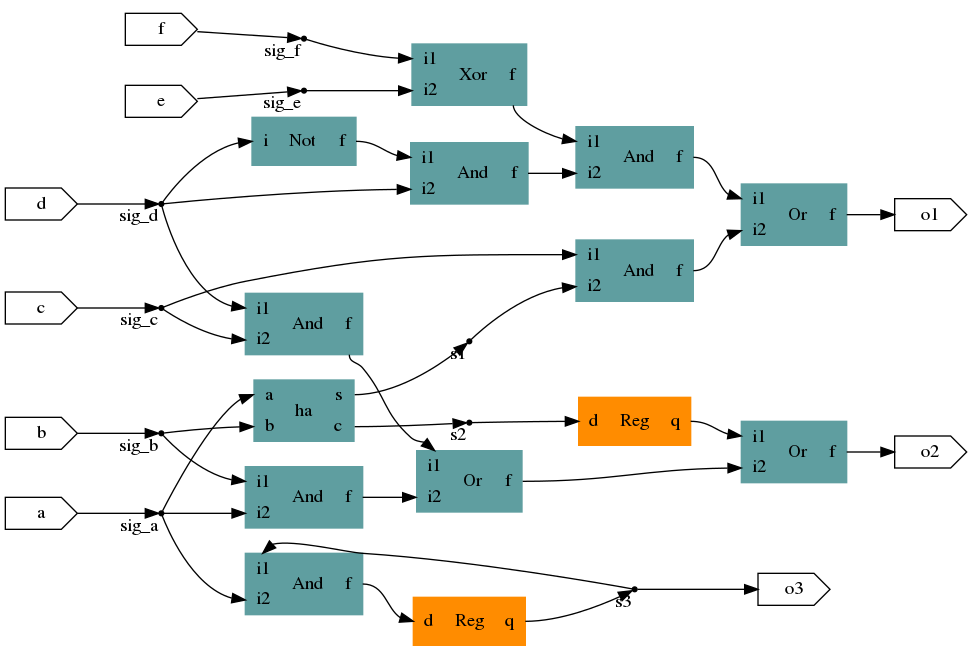

# Synchrony

_**warning** : work in progress / experimental_

## A simple HDL

Synchrony is a tiny Hardware description DSL.

```
require "ha"

circuit Example
  input a,b,c,d,e,f
  output o1,o2,o3

  sig s1,s2,s3

  o1=(s1 and c) or (d and !d) and (e xor f)    # simple expressions
  s1,s2=ha(a,b)                                # use library elements
  o2=(a and b) or (c and d) or reg(s2)         # DFF named 'reg'
  s3=reg(a and s3)
  o3=s3
end
```

Once compiled, this circuit 'Example' will be available for reuse. It is stored in a 'example.lib' file (that is simply a serialized version of Example).

.

## Basic functionalities

- Netlist visualization (Graphiz-based)
- Boolean simplifications
- VHDL & Verilog code generation (WIP)

## Other grammar elements

Synchrony grammar is not fully stabilized yet. Here is an overview of the grammar planed so far :

```
circuit rca{N,M}       # integer parameterized circuit
  input a,b : uint{N}  # parameterized type
  input d   : uint{M}  # parameterized type
  output s  : uint{?}  # please infer
end


circuit test_1
  input  a,e   : bit
  input  b     : uint8
  output c     : int3[4]
  output d     : int23

  sig s1,s2,s3 : bit
  sig s4       : byte  # equivalent to uint8
  sig s5       : sbyte # -128 to 127, equiv int8
  sig s6,s7,s8 : bit

  s1       = a and reg(e)        # reg syntax (async init with reg(e,0))
  s2       = s1 or e$(0)         # alternative reg syntax, with e init at 0
  s3       = !b[0] xor s2$$$(0)  # alternative not, bit access, 3 pipes using $
  d[21..0] = {resize(0x7,15) ,b} # concatenation {} and resizing()
  d[22]    = and3(s1,s2,s3)      # positional arguments call
  s6,s7    = ha(a,e)             # positional circuit returns
  s4       = b*2                 # hummm result will be on size(b)+1
                                 # +,-,*,/,rem,mod
  s8 = a ? (b or c) : (b xor a)  # ternary expressions / mux
end
```

## Install

```
gem install synchrony
```

Note that synchrony depends on rtl_circuit Ruby gem.
